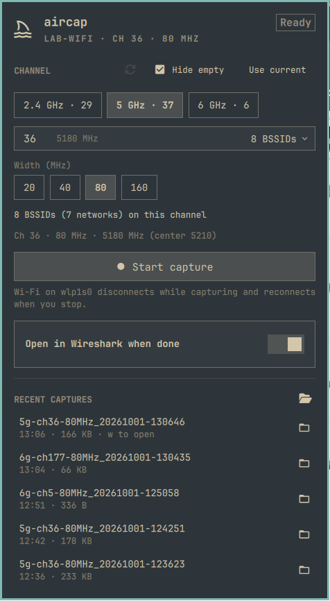

# aircap for Omarchy
An Omarchy bar widget for taking monitor-mode Wi-Fi packet captures. Pick a band, channel, and width, start the capture, watch the packet count, and stop it. The capture is saved as a `.pcapng` file and can open in Wireshark straight away.

aircap is modeled on [Airtool](https://www.intuitibits.com/products/airtool/) by Intuitibits, a macOS menu bar app that does the same job. It is an independent project, not affiliated with or endorsed by Intuitibits, and it covers only local capture; it has none of Airtool's remote capture support.

<p>
  
</p>

## Install
```
omarchy plugin add https://github.com/jwil007/omarchy-aircap.git --enable
```
The widget appears in the bar right away. The first time you open its panel, click **Set up monitor-mode capture**. This opens a terminal that installs Wireshark if it's missing and the capture helper described below, and asks for your sudo password once. You can also run setup directly:
```
~/.config/omarchy/plugins/jwil007.aircap/bin/aircap setup
```

### Dependencies
- A Wi-Fi adapter and driver that support monitor mode (`iw list` shows `monitor` under "Supported interface modes"). Developed and tested on a Qualcomm WCN7850 (ath12k).
- Wireshark (`wireshark-qt`, which includes `dumpcap`). Setup installs it if it's missing.
- NetworkManager or iwd managing the interface. The per-channel BSSID counts need NetworkManager.
- `iw`, `iproute2`, `python3`, `sudo`, and systemd, all included in Omarchy.

### What setup changes
- Installs `wireshark-qt` with `omarchy-pkg-add` if it's not installed.
- Copies `bin/aircap-helper` to `/usr/local/libexec/aircap/aircap-helper`, owned by root.
- Adds `/etc/sudoers.d/aircap`, which lets members of `wheel` run that one helper as root without a password:
  ```
  %wheel ALL=(root) NOPASSWD: /usr/local/libexec/aircap/aircap-helper
  ```
  The rule points at the root-owned copy, not the copy in the plugin directory, so editing the plugin can't change what runs as root. The file is checked with `visudo -c` before it's installed.

The helper accepts only these commands, and validates every argument (interface name, frequency in the radio's enabled channel list, width from a fixed set, numeric center frequency and snap length):

| command | what it does |
|---|---|
| `capture IFACE FREQ WIDTH CENTER1 SNAPLEN RESET` | switch to monitor mode, tune, run `dumpcap`, restore on exit |
| `stop IFACE` | stop the running capture |
| `restore IFACE` | put an interface left in monitor mode back to managed mode |
| `reset IFACE` | unbind and rebind the interface's driver |

It takes no file paths. `dumpcap` writes the capture to stdout and the unprivileged wrapper (`bin/aircap`) redirects it into a file you own.

When an update changes the helper, the panel shows **Update capture helper**. Run setup again to install the new copy.

## Uninstall
```
~/.config/omarchy/plugins/jwil007.aircap/bin/aircap uninstall
```
This stops any running capture, removes the helper, the sudoers rule, and `~/.local/state/aircap`, then asks whether to remove the plugin. Wireshark and your captures are left in place.

If you already removed the plugin with `omarchy plugin remove`, remove the rest by hand:
```
sudo rm -rf /etc/sudoers.d/aircap /usr/local/libexec/aircap /run/aircap
rm -rf ~/.local/state/aircap
```

## Usage

### Bar icon
A shark fin. While a capture runs it turns the urgent color and shows the packet count.

- Left-click: open the panel
- Right-click: start/stop a capture
- Middle-click: open the latest capture in Wireshark

### Choosing a channel
- Bands and channels come from `iw phy`, so only channels enabled in your regulatory domain are listed. DFS and 6 GHz PSC channels are marked.
- Width options are 20/40/80/160 MHz, 320 MHz on 6 GHz, and HT40+/HT40− on 2.4 GHz. A width is offered only when every 20 MHz channel in its block is enabled. The center frequency is calculated from the standard channel blocks and shown under the picker.
- Each channel shows how many BSSIDs the last scan found with that channel as their primary channel, to help you pick a channel that will have traffic. **Hide empty** (on by default) lists only those channels, and switching bands selects the busiest channel. The band buttons show per-band totals.
- **Use current** selects the channel and width you're connected on.

### Capturing
**Start capture** disconnects Wi-Fi for the duration of the capture, the same as Airtool. The panel shows packets, elapsed time, packet rate, and file size. **Stop capture** saves the file, sends a notification with the packet count, reconnects Wi-Fi, and opens the file in Wireshark if **Open in Wireshark when done** is on.

Captures are saved to `~/Captures` (configurable) as `aircap_<band>-ch<N>-<width>MHz_<YYYYmmdd-HHMMSS>.pcapng`. The panel lists the most recent ones: click to open in Wireshark, or use the folder icon to show the file in the file manager.

Keyboard shortcuts: `Enter` start/stop, `2`/`5`/`6` band, `c` current channel, `h` hide empty channels, `r` rescan, `w` open latest capture, `f` open captures folder.

## How a capture works
1. If NetworkManager manages the interface, it is set to unmanaged and its IP addresses are flushed; otherwise iwd is stopped if it's running.
2. The interface is switched to monitor mode and tuned with `iw dev <iface> set freq <control> <width> <center1>`.
3. `dumpcap` runs until you stop it.
4. The interface is switched back to managed mode, its driver is reset (see below), and it is handed back to NetworkManager or iwd.

What was stopped is recorded in `/run/aircap/<iface>.state`, so the restore puts back exactly what was there. If a capture ends without restoring (for example, the shell is killed or the laptop sleeps), the panel shows **Restore Wi-Fi**.

### Driver reset
On ath12k (WCN7850), switching back from monitor mode leaves the firmware in a broken state. Wi-Fi reconnects, then 30–60 seconds later the connection drops (beacon loss) and every authentication attempt times out until the machine is rebooted. Unbinding and rebinding the driver reloads the firmware, which fixes it in a few seconds without a reboot. aircap does this after every capture. Turn off the `resetDriver` setting if your adapter doesn't need it.

To reset the driver by hand, for example after a capture taken with `resetDriver` off:
```
omarchy-shell jwil007.aircap resetRadio
```

### FCS flag fix
ath12k delivers monitor-mode frames with the 4-byte FCS still attached, but its radiotap header doesn't set the "frame includes FCS" flag. Wireshark then reads the FCS as part of the frame, and most beacons and probe responses show errors such as "Tag Length is longer than remaining payload" even though the frames are fine.

After each capture, `bin/aircap-fixfcs` checks every frame: if the last 4 bytes are a valid CRC-32 of the rest of the frame and the flag isn't set, it sets the flag. Only that one bit in the radiotap header changes. Frames without a valid trailing FCS are left alone, so this does nothing on drivers that report the FCS correctly. To fix captures taken with an earlier version:
```
~/.config/omarchy/plugins/jwil007.aircap/bin/aircap fix-fcs ~/Captures/*.pcapng
```

### BSSID counts
Counts come from NetworkManager's scan list (`nmcli device wifi list`), which doesn't need root. NetworkManager drops BSSes it hasn't seen for a few minutes and rarely runs a full scan while connected, so opening the panel requests a new scan if the last one is more than 30 seconds old. The counts update a few seconds later. There is no scan data while a capture is running.

## Limitations
- Only one capture at a time, on one interface.
- Wi-Fi is unavailable while capturing. Use a second adapter if you need to stay connected.
- Channel hopping and remote capture are not supported.

## Reference
```
bin/aircap setup|uninstall
bin/aircap status [iface] [captureDir]
bin/aircap capture IFACE FREQ WIDTH CENTER1 SNAPLEN RESET DIR LABEL
bin/aircap stop|restore|reset IFACE
bin/aircap fix-fcs FILE...
bin/aircap open|reveal FILE
```

Shell IPC:
```
omarchy-shell jwil007.aircap open|close|toggle|start|stop|toggleCapture|restore|resetRadio|rescan|status
```

Settings are stored in the widget's entry in `~/.config/omarchy/shell.json`:

| key               | default      | description |
|-------------------|--------------|-------------|
| `iface`           | `""`         | Wireless interface. Empty uses the first found. |
| `captureDir`      | `~/Captures` | Where captures are saved |
| `openInWireshark` | `true`       | Default for the panel's Wireshark toggle. The toggle remembers your last choice. |
| `resetDriver`     | `true`       | Reset the Wi-Fi driver after each capture |
| `snapLength`      | `0`          | Bytes kept per frame. 0 keeps whole frames. |

## License
MIT
